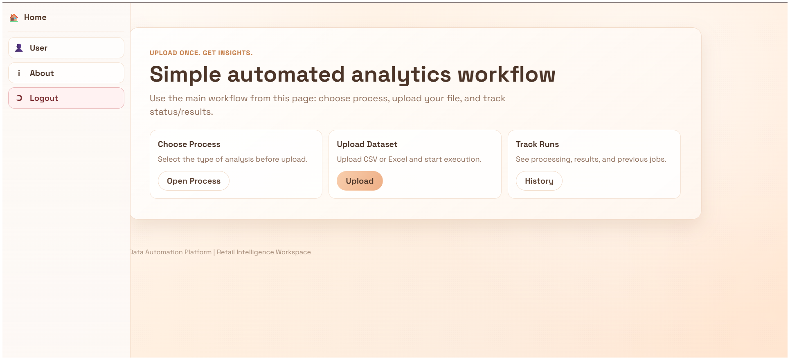
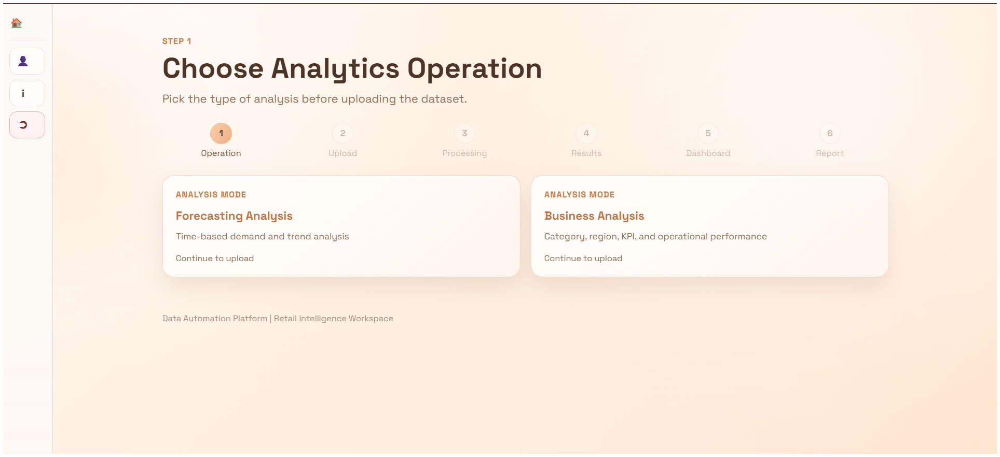
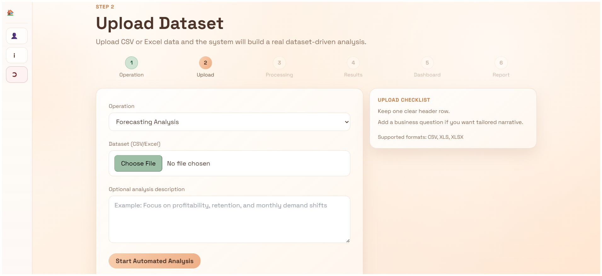
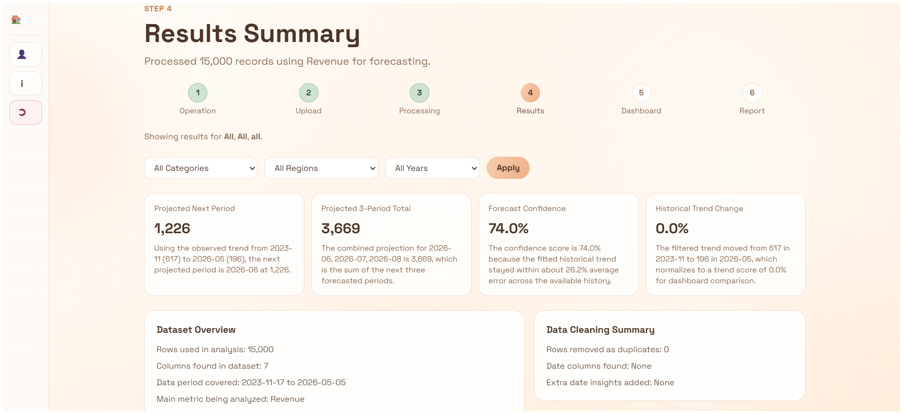
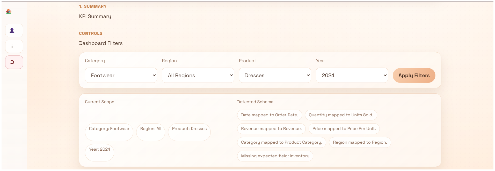
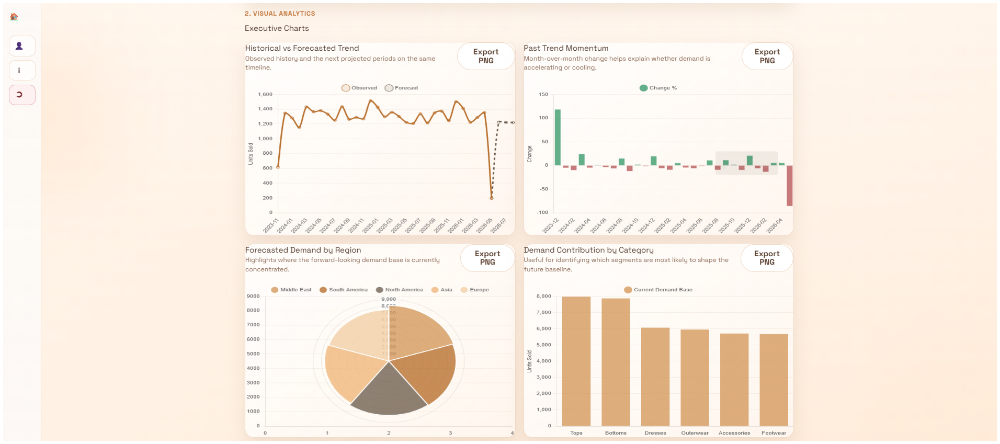
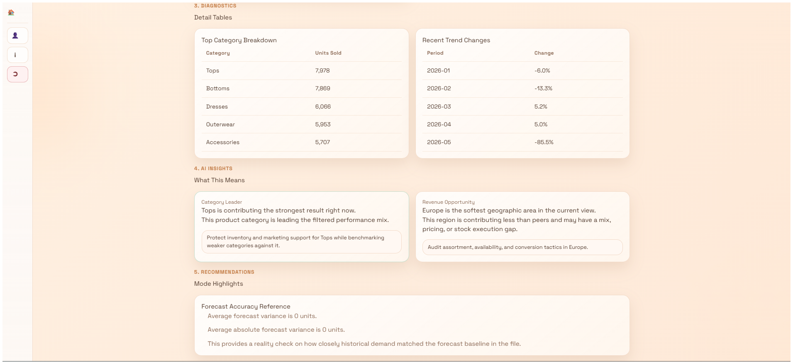
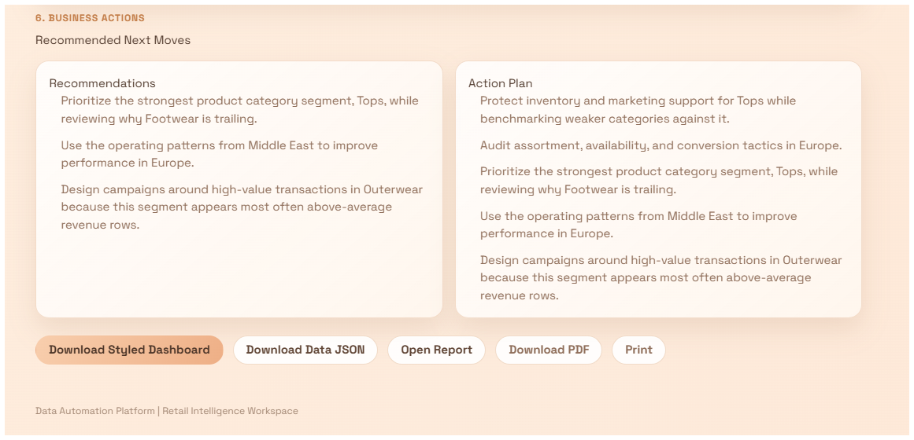
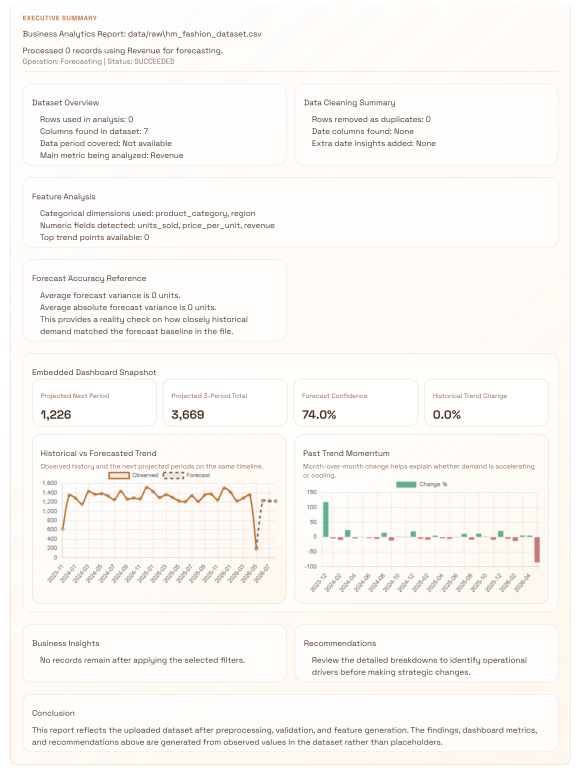

# Data Analysis Automation

Automated analytics platform for retail-style datasets built with Flask, Pandas, Jinja, and an AWS-ready pipeline design.

This project turns a raw CSV/Excel upload into a guided analytics flow with:
- operation selection
- schema detection
- preprocessing and validation
- KPI generation
- forecasting and business analysis views
- dashboard visualizations
- downloadable report artifacts

It is designed to show both product thinking and engineering execution: a usable frontend, a working local pipeline, and a cloud architecture path for full orchestration.


Highlights:
- Built an end-to-end analytics product, not just isolated notebooks or charts.
- Accepts different dataset schemas and infers useful business fields automatically.
- Supports two analysis modes: `Forecasting Analysis` and `Business Analysis`.
- Generates KPI summaries, trend charts, diagnostics, AI-style insight cards, and action recommendations.
- Includes authentication, upload flow, job history, report generation, and dashboard export.
- Structured for AWS expansion with `S3`, `Lambda`, `Step Functions`, `Glue`, `Athena`, `SageMaker`, and `QuickSight`.

## Product Walkthrough

### 1. Home


### 2. Choose analytics operation


### 3. Upload dataset


### 4. Results summary


### 5. KPI filters and schema mapping


### 6. Visual analytics dashboard


### 7. Diagnostics and business insights


### 8. Recommended business actions


### 9. Report preview


## Core Features

- `User authentication`: register, login, OTP verification, reset-password flow.
- `Dataset upload`: supports `.csv`, `.xls`, and `.xlsx`.
- `Operation-first workflow`: user selects the analysis mode before upload.
- `Schema inference`: maps columns like revenue, quantity, date, category, region, and product even when names vary.
- `Automated analytics`: generates metrics, trend summaries, breakdowns, recommendations, and dashboard cards.
- `Forecasting mode`: near-term projections, confidence score, historical trend change, and forward-looking charts.
- `Business analysis mode`: category, product, region, and year filters with KPI summaries and diagnostic tables.
- `Dashboard export`: JSON export and HTML dashboard export.
- `Report generation`: styled report page with printable/downloadable output flow.
- `AWS-ready design`: local stub works today, cloud orchestration path is already scaffolded in `infra/`.

## Tech Stack

- `Frontend`: Flask templates, Jinja2, custom CSS, JavaScript
- `Backend`: Flask, Python
- `Data`: Pandas, NumPy
- `Auth`: Flask-Login, Flask-Bcrypt, OTP flow
- `Cloud target`: AWS S3, Lambda, Step Functions, Glue, Athena, SageMaker, QuickSight
- `Testing`: Pytest

## Architecture

Current working local flow:

```text
Upload Dataset -> Local Stub Pipeline -> Preprocessing -> Analysis Engine -> Dashboard -> Report
```

Target cloud flow:

```text
Upload Dataset -> S3 -> Step Functions -> Lambda -> Glue -> Athena -> SageMaker -> Insight Layer -> QuickSight -> Flask UI
```

Reference docs:
- [docs/architecture.md](docs/architecture.md)
- [docs/MANASVI_PIPELINE_RUNBOOK.md](docs/MANASVI_PIPELINE_RUNBOOK.md)
- [infra/stepfunctions/analytics_orchestrator.asl.json](infra/stepfunctions/analytics_orchestrator.asl.json)

## What I Built

This repository demonstrates work across:
- product workflow design
- Flask backend routing
- data preprocessing and analytics logic
- schema inference for messy business datasets
- dashboard/report UX
- AWS integration planning and infra contracts

Especially relevant engineering areas:
- [app/routes/analysis.py](app/routes/analysis.py)
- [app/routes/dataset.py](app/routes/dataset.py)
- [app/services/analytics_service.py](app/services/analytics_service.py)
- [app/services/pipeline/data_pipeline.py](app/services/pipeline/data_pipeline.py)
- [app/services/report_service.py](app/services/report_service.py)

## Estimated Cost And Business Value

### Local development cost

- Local build/test cost: effectively `$0` in cloud spend because the project currently runs through a local stub pipeline.
- The app can be demonstrated entirely from local Flask + local file processing.

### Small demo cloud cost

This section is an estimate, not a production bill.

For a lightweight demo workload, the non-QuickSight AWS services can stay very cheap because:
- `S3` is pay-as-you-go with no minimum charge.
- `Lambda` includes `1 million free requests/month` and `400,000 GB-seconds/month`.
- `Step Functions` includes `4,000 free state transitions/month`.
- `Athena` is billed by data scanned, with AWS pricing examples showing `USD 5/TB scanned`.

Practical recruiter summary:
- A student/demo version can often run in the `low single-digit USD/month` range if usage is small.
- The first meaningful recurring dashboard cost is usually `QuickSight`, where AWS lists `Author` pricing starting at `USD 24/user/month`.

### Business value framing

This project does not claim verified production revenue impact yet.

What it is built to save:
- manual Excel cleaning and slicing
- repetitive KPI reporting work
- repeated chart building for each uploaded dataset
- time spent translating raw numbers into business actions

Reasonable value statement for recruiters:
- Automates a workflow that would otherwise take an analyst hours per dataset.
- Reduces the time from upload to insight to a guided, repeatable flow.
- Makes exploratory retail analytics usable by non-technical stakeholders through dashboards and narrative recommendations.

## Public Deployment Status

Current status:
- `Working locally`: yes
- `Public cloud deployment`: not completed yet
- `Reason`: the live AWS pipeline is scaffolded, but the current execution path is still routed through a local stub while cloud resource handoff/integration is completed

This means the project is already strong as a portfolio piece because:
- the product workflow is real
- the local pipeline is functional
- the cloud architecture is documented
- the repo shows a clear path from prototype to production-ready orchestration

## Local Setup

```powershell
python -m venv .venv
.\.venv\Scripts\Activate.ps1
python -m pip install -r requirements.txt
Copy-Item .env.example .env
python run.py
```

Open:

```text
http://127.0.0.1:5000
```

## Environment Variables

Minimum local configuration:

```env
SECRET_KEY=change-me
AWS_REGION=ap-south-1
S3_BUCKET_DATASETS=demo-bucket-name
AUTH_DB_PATH=instance/data_automation.db
OTP_EXPIRY_MINUTES=10
OTP_RESEND_COOLDOWN_SECONDS=45
```

See:
- [.env.example](.env.example)
- [app/config.py](app/config.py)

## Run Tests

```powershell
python -m pytest -q
```

Additional validation and reports:
- [docs/test_logs/TEST_EXECUTION_SUMMARY.md](docs/test_logs/TEST_EXECUTION_SUMMARY.md)
- [docs/testing_report/FINAL_TEST_REPORT.md](docs/testing_report/FINAL_TEST_REPORT.md)

## Repository Structure

```text
app/
  routes/         Flask routes and workflow endpoints
  services/       analytics, reports, pipeline, auth helpers
  templates/      Jinja pages and reusable UI
  static/         CSS and JS
data/
  raw/            sample input datasets
  processed/      generated processed outputs
docs/
  architecture, testing, screenshots, runbooks
infra/
  stepfunctions, athena, lambda payload examples
run.py
requirements.txt
```

## Roadmap

- Replace the local stub with live AWS orchestration.
- Persist users/jobs/results in cloud storage services.
- Wire real status polling from Step Functions.
- Add production-grade report export and downloadable artifacts.
- Embed cloud BI dashboards for a full hosted analytics experience.

## Notes

- `.env` and local virtual environments are excluded from version control.
- Some generated files and sample datasets are intentionally kept because they help demonstrate the full workflow.
- If you want a leaner production repo later, generated artifacts can be reduced into a smaller demo dataset pack.

## AWS Pricing References

These links were used for the cost framing above:
- [AWS Lambda Pricing](https://aws.amazon.com/lambda/pricing/)
- [AWS Step Functions Pricing](https://aws.amazon.com/step-functions/pricing/)
- [Amazon Athena Pricing](https://aws.amazon.com/athena/pricing/)
- [Amazon S3 Pricing](https://aws.amazon.com/s3/pricing/)
- [Amazon QuickSight Pricing](https://aws.amazon.com/quicksight/pricing/)
